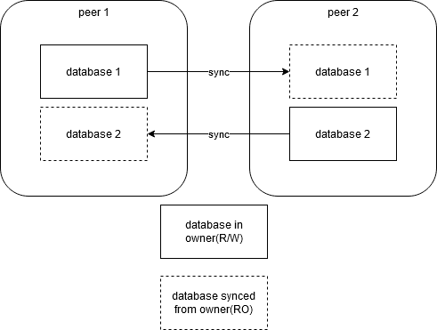

# ipdb

a simple key-value database based on ipfs and ipns.

# Design

This library is designed for data storage in p2p-like environment, where the owner of the data writes to the database and the consumers read the data.

**Todo**:

1. basic functions
2. extract the standard to allow implementation in other languages
3. allow nested database

**Not Todo**:

1. sharded database
2. anonymous data sharing
